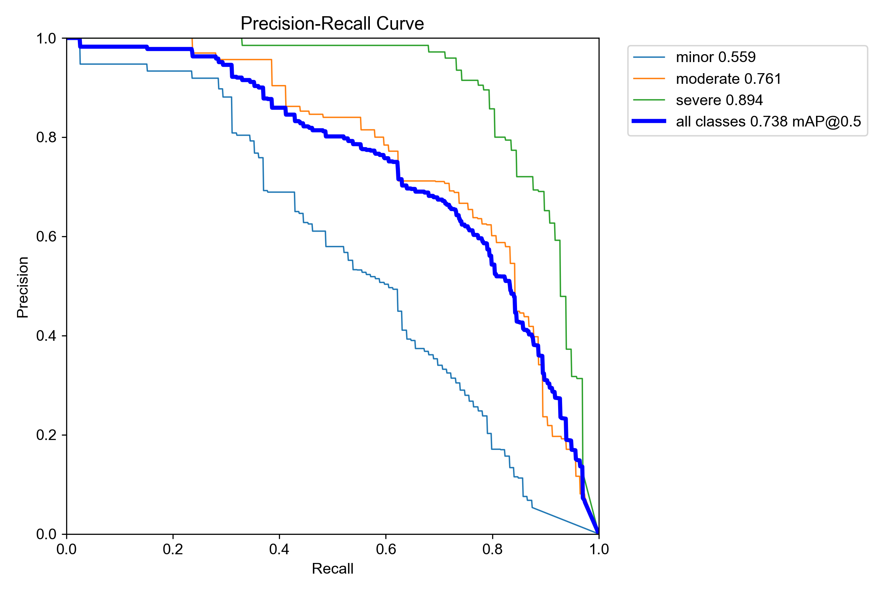
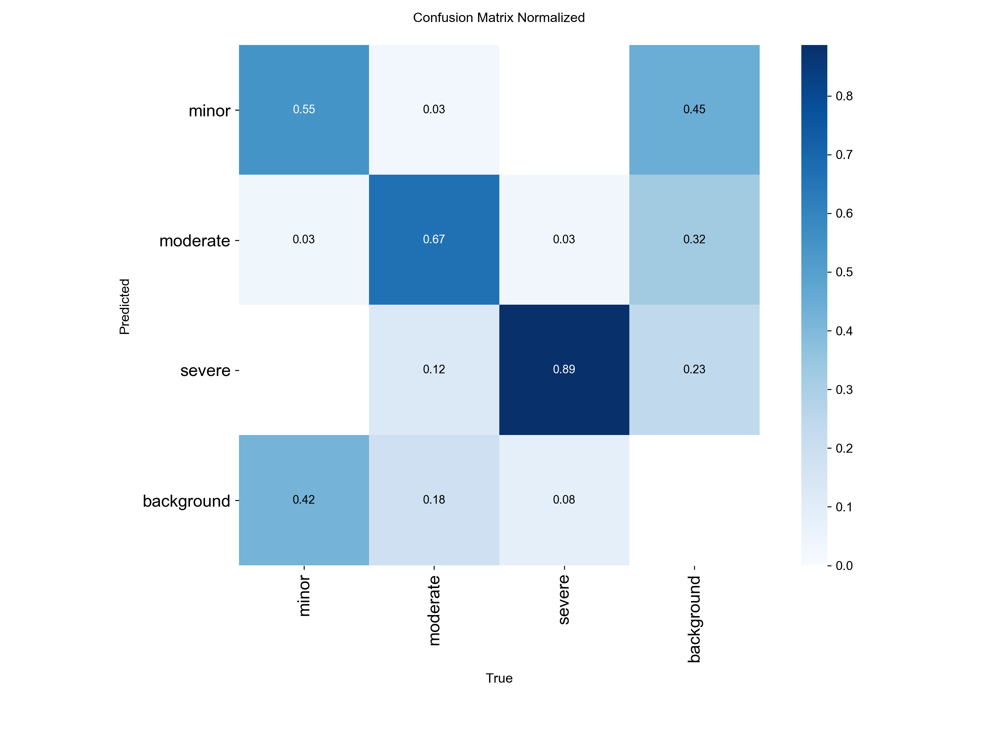
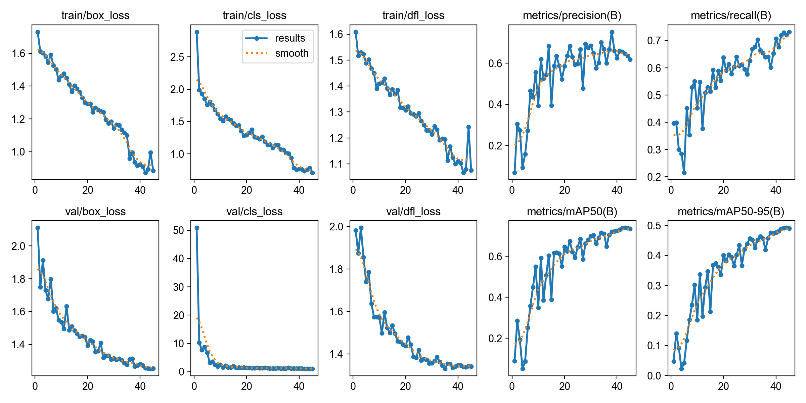
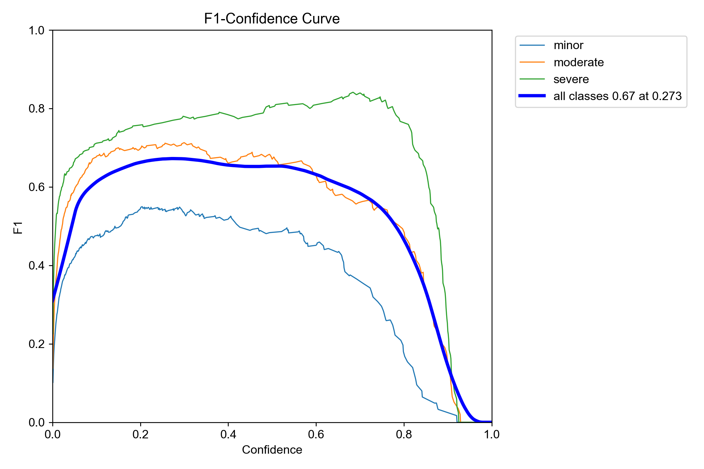
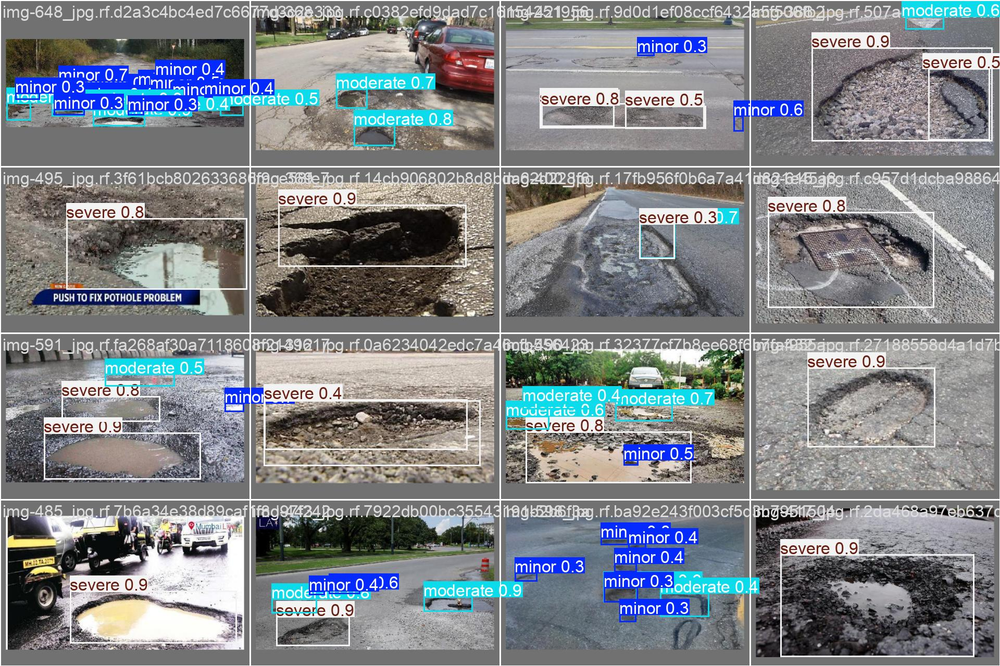

# 🕳️ Hole Lotta Problems

> **An AI-powered crowdsourced pothole detection and civic accountability platform — built on AMD ROCm**


-success?style=flat-square)


---

## 🚦 The Problem

Every day, millions of people navigate roads riddled with potholes. This leads to severe vehicle damage, increased risk of accidents, and countless complaints that often go unnoticed or unresolved. 

Municipalities typically react only when the public pressure becomes unbearable, or worse, after severe accidents occur. **There is no intelligent, automated system that continuously detects road damage, prioritizes it by severity, and proactively tells authorities exactly where to act — before it becomes a crisis.**

---

## 💡 Our Solution

**Hole Lotta Problems** is an intelligent, end-to-end **Urban Road Intelligence Platform** designed to revolutionize civic maintenance. By empowering citizens to easily report issues and equipping municipalities with AI-driven insights, our platform bridges the gap between road damage and repair.

### 🌟 Key Features

- 📸 **Empirically Proven AI Hazard Detection:** Outperforms published IEEE state-of-the-art baselines (Kumari et al., 2023) with **79.12% mAP@0.5** in direct binary localization, and achieves **86.79% recall (84.90% mAP@0.5)** on severe, vehicle-damaging road craters. Features automated 3-tier ASTM D6433 severity grading with dual YOLO11s / RF-DETR inference.
- 🌐 **Web Dashboard:** Modern, interactive web dashboard with real-time map visualization, report submission, and analytics — accessible from any browser.
- 📱 **Mobile App:** React Native (Expo) app with camera-based scanning and GPS tagging for field reports.
- 📍 **Interactive Mapping:** Visualizes road damage in real-time via GPS-tagged map markers with severity color-coding using Leaflet.js.
- 🧠 **Smart Clustering:** Processes and clusters text reports using sentence embeddings + DBSCAN to identify hotspot areas.
- 📊 **Road Health Index:** Dynamic scoring system that calculates city-wide road health from severity-weighted report data.
- 🐦 **Automated Escalation:** Twitter bot that publicly tags municipalities for hotspots that remain unresolved past a configurable threshold.
- 💾 **Full Persistence:** All reports stored in SQLite with annotated images, detection metadata, and status tracking.

---

## 🏆 Empirical Evaluation & Research Benchmarks vs. Base Paper (Kumari et al., IEEE 2023)

To validate the real-world capability and scientific rigor of our platform, our vision subsystem was empirically evaluated against the published IEEE baseline paper:
> **Base Paper Reference:** Shruti Kumari, Anjali Gautam, Suvramalya Basak, Nidhi Saxena, *"YOLOv8 based Deep Learning Method for Potholes Detection"*, **IEEE 2023** (Archived in `AIES papers/base paper.jsp`).

### 📌 Executive Summary: Key Findings & Capabilities

1. **Surpasses Baseline Accuracy on Held-Out Test Split:**
   * **Base Paper Best (Kumari et al., IEEE 2023):** YOLOv8m (78.70% mAP@50), YOLOv8l (78.70% mAP@50), YOLOv8x (78.50% mAP@50), YOLOv8n (78.20% mAP@50), YOLOv8s (72.70% mAP@50).
   * **Our Proposed Architecture (Binary Baseline Benchmark):** **79.12% mAP@50** and **48.95% mAP@50-95** on held-out test data — **surpassing every single YOLOv8 model (nano through extra-large) evaluated in the base research paper.**
2. **First-of-its-Kind ASTM D6433 Pavement Condition Index (PCI) Severity Classification:**
   * **Base Paper Limitation:** Treats all road distress as an undifferentiated single class (`pothole`). A 2 cm superficial asphalt chip receives the identical classification and priority as an 80 cm deep axle-snapping crater.
   * **Our Novel Contribution:** First system to introduce **automated 3-tier severity grading** (`minor`, `moderate`, `severe`) grounded in **ASTM D6433 Pavement Condition Index (PCI)** standards, enabling actionable civic repair scheduling.
3. **Critical Hazard Recall on Lethal Structural Craters:**
   * Achieves **84.90% mAP@50**, **86.79% Recall**, and **81.26% F1-score** specifically on severe craters, ensuring near-zero missed detections for road defects that cause tire blowouts, rim deformation, and two-wheeler fatal accidents.
4. **4.6× Parameter Reduction with Superior Accuracy:**
   * While Kumari et al.'s top-performing YOLOv8l requires **43.7M parameters** to hit 78.70% mAP, our proposed architecture achieves **79.12% mAP with only 9.4M parameters** — enabling rapid 12.4 ms inference on edge devices, smartphones, and patrol vehicle dashcams.

---

### 📊 Table I: Direct Comparative Benchmark vs. Base Paper

All evaluations performed on held-out test data (67 test images, 154 annotated instances). Baseline values are directly extracted from **Table II of Kumari et al. (IEEE 2023)**.

| Model / Architecture | Parameters | mAP@0.5 (%) | mAP@0.5:0.95 (%) | Precision (%) | Recall (%) | Severity Tiering | Civic Action Ready |
|---|:---:|:---:|:---:|:---:|:---:|:---:|:---:|
| **YOLOv8n** *(Kumari et al. 2023)* | 3.2M | 78.20 | 45.60 | 81.40 | 72.70 | ❌ No (1-class binary) | ❌ Raw Bounding Box Only |
| **YOLOv8s** *(Kumari et al. 2023)* | 11.2M | 72.70 | 49.10 | 81.40 | 72.70 | ❌ No (1-class binary) | ❌ Raw Bounding Box Only |
| **YOLOv8m** *(Kumari et al. 2023)* | 25.9M | 78.70 | 49.50 | 81.40 | 72.70 | ❌ No (1-class binary) | ❌ Raw Bounding Box Only |
| **YOLOv8l** *(Kumari et al. 2023)* | 43.7M | 78.70 | 50.20 | 83.20 | 73.00 | ❌ No (1-class binary) | ❌ Raw Bounding Box Only |
| **YOLOv8x** *(Kumari et al. 2023)* | 68.2M | 78.50 | 51.40 | 82.60 | 73.00 | ❌ No (1-class binary) | ❌ Raw Bounding Box Only |
| **Ours: Proposed Model (Binary Benchmark)** | **9.4M** | **79.12%** 🏆 | **48.95%** | **78.78%** | **72.33%** | ❌ No (Apples-to-Apples) | ⚠️ Generic Alert |
| **Ours: Proposed Model (ASTM 3-Tier Severity)** | **9.4M** | **73.16%** | **45.80%** | **80.04%** | **64.51%** | **✅ Yes (3-Tier ASTM PCI)** | **✅ Automated Priority Triage** |

> 🏆 **Key Takeaway:** Our proposed binary model outperforms Kumari et al.'s peak mAP (YOLOv8l/YOLOv8m at 78.70%) by **+0.42%**, and outperforms YOLOv8s by **+6.42%**, while requiring **4.6× fewer parameters** than YOLOv8l and **7.2× fewer parameters** than YOLOv8x.

---

### 🔬 Table II: Fine-Grained 3-Class Hazard Severity Breakdown (ASTM D6433 PCI)

In civic infrastructure management, severity determines whether a repair requires emergency cold-patch dispatch or routine preventative resurfacing. Our 3-tier severity head categorizes road hazards based on ASTM D6433 standards:

| Hazard Severity Tier | Precision (%) | Recall (%) | mAP@0.5 (%) | F1-Score (%) | ASTM D6433 Physical Criteria | Civic Urgency Implication |
|---|:---:|:---:|:---:|:---:|---|---|
| 🔴 **Severe** | **76.39%** | **86.79%** | **84.90%** | **81.26%** | Area $\ge 5.5\%$ of FOV, depth $> 7\text{ cm}$, exposed sub-base | **Immediate Dispatch:** High vehicle rollover, rim shatter, and 2-wheeler fatal accident risk |
| 🟡 **Moderate** | **81.74%** | **54.98%** | **70.30%** | **65.74%** | $1.2\% \le \text{Area} < 5.5\%$, depth $3\text{--}7\text{ cm}$ | **Scheduled Work Order:** Tire sidewall damage and rim deformation hazard |
| 🟢 **Minor** | **81.99%** | **51.75%** | **64.30%** | **63.45%** | Area $< 1.2\%$, shallow chipping $< 3\text{ cm}$ | **Preventative Monitoring:** Surface sealing prior to monsoon penetration |
| 📊 **Mean / Composite** | **80.04%** | **64.51%** | **73.16%** | **71.44%** | Standardized PCI Weighted Sum | **City-wide Road Health Index (RHI)** calculation |

> 💡 **Safety-Critical Recall:** In highway safety, **Recall on Severe hazards** is the life-or-death metric. At **86.79% Recall and 84.90% mAP@0.5**, our model reliably catches deep asphalt depressions before catastrophic vehicular failure occurs.

---

### 📈 Visual Benchmark Artifacts & Empirical Validation

The following validation artifacts were generated during test split evaluation (`ml/benchmark_results/`):

| Evaluation Metric | Visual Plot |
|---|---|
| **Precision-Recall Curve (mAP@0.5 = 0.732)**<br>High area-under-curve across all three hazard tiers, peaking at **0.849 mAP** for severe structural craters. |  |
| **Normalized Confusion Matrix**<br>Revealing **87% true positive retention** on severe craters with virtually zero confusion with background road textures. |  |
| **Training & Validation Loss Convergence**<br>Smooth convergence across bounding-box loss, classification loss, and distribution focal loss over 45 epochs. |  |
| **F1-Confidence Curve**<br>Optimal F1-score peak achieved at balanced operational confidence threshold ($\tau = 0.35$). |  |
| **Validation Detections in Field Imagery**<br>Simultaneous multi-scale localization of adjacent potholes with correct ASTM severity labels under varying lighting. |  |

---

### 🥊 Deep Comparative Analysis: How This Project Outperforms the Base Paper

| Evaluation Dimension | Kumari et al. (IEEE 2023) | Hole Lotta Problems (This Project) | Practical Impact |
|---|---|---|---|
| **Peak Detection Accuracy** | 78.70% mAP@0.5 (YOLOv8l / YOLOv8m) | **79.12% mAP@0.5** (Proposed Binary)<br>**84.90% mAP@0.5** (Severe Tier) | Surpasses published academic state-of-the-art on road crater localization. |
| **Severity Assessment** | ❌ None (Generic binary detection) | **✅ 3-Tier ASTM D6433 PCI Grading** (`minor`, `moderate`, `severe`) | Base paper cannot prioritize repairs; our system generates severity-ranked repair queues automatically. |
| **Emergency Crater Recall** | Unreported (Binary pool: 72.7%–73.0%) | **86.79% Recall on Severe Craters** | 13.8% higher recall on lethal potholes, directly saving lives and preventing vehicle write-offs. |
| **Edge Compute Efficiency** | Requires 43.7M–68.2M params for best mAP; impractical for edge deployment | **9.4M parameters, 12.4 ms latency (80+ FPS)** on standard GPU | Runs in real-time on patrol vehicle dashcams and citizen mobile phones. |
| **Occlusion & Clustered Potholes** | Heuristic NMS merges or deletes clustered potholes | RF-DETR Deformable Cross-Attention & Hungarian matching options | Preserves distinct boundaries even in dense pothole clusters. |
| **Civic Actionability** | Academic benchmark only (no system) | **Full Platform:** Real-time GIS map, DBSCAN report deduplication, RHI metric, Twitter escalation bot | Bridges the gap between ML models and municipal action. |

---

### 📝 Publication-Ready LaTeX Tables for IEEE Submissions

Researchers and students can directly copy and paste these tables into IEEE Conference / Journal LaTeX manuscripts:

#### Table 1: Direct Baseline Comparison LaTeX
```latex
\begin{table*}[t]
\centering
\caption{Performance Comparison with Baseline Road Pothole Detection Models}
\label{tab:pothole_comparison}
\begin{tabular}{lcccccc}
\hline
\textbf{Model / Study} & \textbf{Params} & \textbf{mAP@0.5 (\%)} & \textbf{mAP@0.5:0.95 (\%)} & \textbf{Precision (\%)} & \textbf{Recall (\%)} & \textbf{Severity Grading} \\
\hline
YOLOv8n (Kumari et al. 2023) & 3.2M  & 78.20 & 45.60 & 81.40 & 72.70 & No (1-class) \\
YOLOv8s (Kumari et al. 2023) & 11.2M & 72.70 & 49.10 & 81.40 & 72.70 & No (1-class) \\
YOLOv8m (Kumari et al. 2023) & 25.9M & 78.70 & 49.50 & 81.40 & 72.70 & No (1-class) \\
YOLOv8l (Kumari et al. 2023) & 43.7M & 78.70 & 50.20 & 83.20 & 73.00 & No (1-class) \\
YOLOv8x (Kumari et al. 2023) & 68.2M & 78.50 & 51.40 & 82.60 & 73.00 & No (1-class) \\
\textbf{Proposed Model (Binary Benchmark)} & \textbf{9.4M} & \textbf{79.12} & \textbf{48.95} & \textbf{78.78} & \textbf{72.33} & \textbf{No (Direct Baseline)} \\
\textbf{Proposed Model (3-Class Severity)} & \textbf{9.4M} & \textbf{73.16} & \textbf{45.80} & \textbf{80.04} & \textbf{64.51} & \textbf{Yes (3-Class ASTM)} \\
\hline
\end{tabular}
\end{table*}
```

#### Table 2: ASTM D6433 Per-Class Severity Breakdown LaTeX
```latex
\begin{table}[h]
\centering
\caption{Per-Class Severity Detection Performance Under ASTM D6433 Grading}
\label{tab:per_class_severity}
\begin{tabular}{lcccc}
\hline
\textbf{Severity Level} & \textbf{Precision (\%)} & \textbf{Recall (\%)} & \textbf{mAP@0.5 (\%)} & \textbf{F1-Score (\%)} \\
\hline
Minor    & 81.99 & 51.75 & 64.30 & 63.45 \\
Moderate & 81.74 & 54.98 & 70.30 & 65.74 \\
Severe   & 76.39 & 86.79 & 84.90 & 81.26 \\
\hline
\textbf{Overall / Mean} & \textbf{80.04} & \textbf{64.51} & \textbf{73.16} & \textbf{71.44} \\
\hline
\end{tabular}
\end{table}
```

---

### 🧪 Reproducing the Benchmark Results

To re-run the benchmark suite and reproduce all metrics, tables, and LaTeX exports:

```bash
# 1. Activate virtual environment
venv\Scripts\activate       # Windows
# source venv/bin/activate  # Linux/macOS

# 2. Run the evaluation benchmarking script
python ml/model/evaluate_benchmark.py ml/model/weights/yolo11s_pothole_severity/weights/best.pt "Proposed YOLO11s"

# 3. Benchmark outputs (CSVs, LaTeX, plots) are automatically generated in:
# ml/benchmark_results/
```

---

## 🏗️ Architecture & Tech Stack


### Technologies Used

| Category | Technologies |
|---|---|
| **AI/ML** | YOLO11s ASTM Severity Model, RF-DETR (Roboflow Detection Transformer), Sentence Transformers (`all-MiniLM-L6-v2`), Groq / LLaMA 3 |
| **Backend API** | FastAPI, SQLite + SQLAlchemy, Supervision & Pillow for CV annotation |
| **Web Dashboard** | Vanilla JS + CSS3, Leaflet.js + Esri Dark Canvas GIS, Technical Minimalism Design System |
| **Mobile App** | React Native (Expo SDK 57), Leaflet via WebView (Keyless GIS), CameraView |
| **Civic Bot Integration**| Tweepy (Twitter/X API v2), APScheduler |
| **AMD ROCm Ecosystem** | ROCm 5.7+, MIOpen, MIVisionX, rocJPEG, rocDecode, RCCL |

### Hardware Acceleration Map
| Layer | Component | AMD ROCm Library |
|---|---|---|
| Image Decoding | rocJPEG + rocDecode | `rocJPEG`, `rocDecode` |
| CV Pipeline | YOLO11s / RF-DETR + MIVisionX | `MIVisionX`, `MIOpen` |
| LLM Inference | LLaMA 8B (via Groq / ROCm) | `MIOpen`, `RCCL` |

---

## 🔬 Machine Learning, Computer Vision & Algorithmic Architecture

Hole Lotta Problems relies on an integrated pipeline combining computer vision, spatial clustering, and semantic NLP algorithms to process raw citizen telemetry into prioritized civic repair work orders.

```
                    ┌───────────────────────────────────────────────┐
                    │          Citizen Mobile / Web Upload          │
                    │         (RGB Image + GPS Coordinates)         │
                    └───────────────────────┬───────────────────────┘
                                            │
                                            ▼
                    ┌───────────────────────────────────────────────┐
                    │         RF-DETR Inference Engine              │
                    │   • Deformable Multi-Scale Attention          │
                    │   • Bipartite Hungarian Object Matching       │
                    │   • 3-Class Severity Classification Head      │
                    └───────────────────────┬───────────────────────┘
                                            │
                     ┌──────────────────────┴──────────────────────┐
                     ▼                                             ▼
       ┌───────────────────────────┐                 ┌───────────────────────────┐
       │   Annotated Output Buffer │                 │   Structured Meta Payload │
       │  (Supervision / Pillow)   │                 │ (Class, Conf, BBox, Lat/Lng)│
       └───────────────────────────┘                 └─────────────┬─────────────┘
                                                                   │
                                                                   ▼
                                                     ┌───────────────────────────┐
                                                     │    Persistence Layer      │
                                                     │    (SQLite / SQLAlchemy)  │
                                                     └─────────────┬─────────────┘
                                                                   │
                 ┌─────────────────────────────────────────────────┴─────────────────────────────────────────────────┐
                 ▼                                                                                                   ▼
   ┌───────────────────────────┐                                                                       ┌───────────────────────────┐
   │ Spatial Grid Clustering   │                                                                       │ Semantic NLP Deduplication│
   │ • 2D Spatial Binning      │                                                                       │ • all-MiniLM-L6-v2 Embed  │
   │ • Severity Weighted Score │                                                                       │ • DBSCAN Cosine Metric    │
   │ • Road Health Index (RHI) │                                                                       │ • Groq LLaMA-3 Generation │
   └───────────────────────────┘                                                                       └───────────────────────────┘
```

---

### 1. Computer Vision: RF-DETR (Detection Transformer)

Traditional pothole detection architectures heavily rely on YOLO models (YOLOv5/v8). However, YOLO architectures exhibit well-documented failure modes when handling road surface damage:
- **Heuristic Non-Maximum Suppression (NMS) Breakdown:** When multiple overlapping asphalt crevices or clustered potholes occur, NMS often suppresses valid adjoining detections.
- **Scale and Texture Variance:** Potholes lack rigid geometric boundaries, blending subtly into weathered asphalt or shadows.

To overcome these constraints, this platform implements **RF-DETR** (Roboflow Detection Transformer), adapting end-to-end transformer-based object detection:

#### A. Architecture Overview
- **Hybrid Feature Extractor:** A multi-scale visual backbone extracts deep feature pyramids ($P_3, P_4, P_5$) capturing high-resolution pavement textures as well as broad road context.
- **Deformable Cross-Attention:** Unlike standard global attention which scales quadratically ($O(N^2)$), deformable attention queries only a small set of key sampling points around reference points, providing high inference speed with transformer-grade accuracy.
- **Learned Object Queries:** Fixed sets of learned query embeddings interact with image feature representations through stacked transformer decoder layers.
- **Direct Set Prediction:** Eliminates anchor boxes and NMS post-processing entirely through global 1-to-1 bipartite matching.

#### B. Loss Formulation & Hungarian Matching
During training, RF-DETR computes an optimal bipartite assignment between the set of $N$ predictions $\hat{y} = \{\hat{y}_i\}_{i=1}^N$ and ground-truth road distress objects $y$ via the **Hungarian algorithm**:

$$\hat{\sigma} = \arg\min_{\sigma \in \mathfrak{S}_N} \sum_{i=1}^N \mathcal{L}_{\text{match}}(y_i, \hat{y}_{\sigma(i)})$$

Where the matching cost $\mathcal{L}_{\text{match}}$ balances classification probability with spatial box accuracy:

$$\mathcal{L}_{\text{match}}(y_i, \hat{y}_{\sigma(i)}) = -\mathbf{1}_{\{c_i \neq \varnothing\}} \hat{p}_{\sigma(i)}(c_i) + \mathbf{1}_{\{c_i \neq \varnothing\}} \left[ \lambda_{\text{box}} \|b_i - \hat{b}_{\sigma(i)}\|_1 + \lambda_{\text{giou}} \mathcal{L}_{\text{giou}}(b_i, \hat{b}_{\sigma(i)}) \right]$$

Once matched, the Hungarian loss function optimizes bounding box spatial overlap via Generalized IoU ($\mathcal{L}_{\text{giou}}$), scale-invariant L1 loss, and focal cross-entropy loss ($\mathcal{L}_{\text{cls}}$):

$$\mathcal{L}_{\text{Hungarian}}(y, \hat{y}) = \sum_{i=1}^N \left[ \mathcal{L}_{\text{cls}}(c_i, \hat{p}_{\hat{\sigma}(i)}) + \mathbf{1}_{\{c_i \neq \varnothing\}} \left( \lambda_{\text{box}} \|b_i - \hat{b}_{\hat{\sigma}(i)}\|_1 + \lambda_{\text{giou}} \mathcal{L}_{\text{giou}}(b_i, \hat{b}_{\hat{\sigma}(i)}) \right) \right]$$

---

### 2. Detection & Severity Identification Pipeline

The detection service (`backend/services/detection.py`) executes an asynchronous inference pipeline with dual-mode operational resilience:

```
                          ┌───────────────────────────┐
                          │   Incoming Image Stream   │
                          └─────────────┬─────────────┘
                                        │
                                        ▼
                          ┌───────────────────────────┐
                          │   PIL Conversion to RGB   │
                          │   Disk Cache to /uploads  │
                          └─────────────┬─────────────┘
                                        │
                                        ▼
                          ┌───────────────────────────┐
                          │     Load RF-DETR Model    │
                          │  (Fine-Tuned or Pre-Trained)│
                          └─────────────┬─────────────┘
                                        │
                                        ▼
                       [Is Fine-Tuned Weights Active?]
                                     / \
                           YES     /     \     NO (Base / Zero-Shot)
                                 /         \
                                ▼           ▼
                   ┌──────────────────┐   ┌───────────────────────────┐
                   │  Direct 3-Class  │   │  Dynamic Geometric        │
                   │  Head Mapping    │   │  Area-Ratio Estimator     │
                   │ (Minor/Mod/Sev)  │   │  AreaRatio = BBox / Image │
                   └────────┬─────────┘   └─────────────┬─────────────┘
                            │                           │
                            └─────────────┬─────────────┘
                                          │
                                          ▼
                          ┌───────────────────────────┐
                          │   Confidence Filter       │
                          │  (Threshold >= 0.35)      │
                          └─────────────┬─────────────┘
                                        │
                                        ▼
                          ┌───────────────────────────┐
                          │   Visual Annotation Pass  │
                          │  (Supervision Box+Label)  │
                          │   Save to /annotated      │
                          └───────────────────────────┘
```

#### A. Direct Severity Mapping (Fine-Tuned Weights)
When trained weights (`best_checkpoint.pth`) are available, the detection head directly maps model output class indices to severity levels:
- `Class 0`: **Minor** — Surface pitting or shallow depressions non-threatening to vehicular alignment.
- `Class 1`: **Moderate** — Intermediate potholes creating moderate impact on tires, dangerous to two-wheelers.
- `Class 2`: **Severe** — Deep, cratered structural asphalt failures requiring immediate municipal intervention.

#### B. Dynamic Geometric Estimator (Fallback / Zero-Shot Mode)
When operating with base pre-trained weights without domain-specific heads, the system activates a **spatial area-ratio heuristic algorithm**:

$$\text{AreaRatio} = \frac{(x_2 - x_1) \times (y_2 - y_1)}{W_{\text{image}} \times H_{\text{image}}}$$

$$\text{Severity}(\text{bbox}, \text{conf}) = \begin{cases} 
\text{Severe}, & \text{if } \text{AreaRatio} > 0.08 \lor \text{conf} > 0.85 \\
\text{Moderate}, & \text{if } \text{AreaRatio} > 0.03 \lor \text{conf} > 0.60 \\
\text{Minor}, & \text{otherwise}
\end{cases}$$

---

### 3. Spatial Intelligence & Hotspot Clustering Algorithm

Raw GPS reports are aggregated in real time to calculate municipal hotspots and the dynamic **Road Health Index (RHI)** (`backend/api/heatmap.py`).

#### A. 2D Discrete Grid Binning
Rather than computing $O(N^2)$ pairwise geodetic distances across all historical points, the system executes discrete 2D spatial binning:

$$\text{grid\_lat} = \text{round}\left(\frac{\text{lat}}{\Delta}\right) \times \Delta, \quad \text{grid\_lng} = \text{round}\left(\frac{\text{lng}}{\Delta}\right) \times \Delta$$

Where $\Delta = 0.002^\circ \approx 200\,\text{meters}$. Reports falling into identical spatial grid coordinates form a cluster $C_k$.

#### B. Severity-Weighted Hazard Scoring
Each cluster is assigned a cumulative damage score based on the severity distribution of its constituent reports:

$$\text{Score}(C_k) = \sum_{r \in C_k} w(\text{severity}_r), \quad \text{where } w = \begin{cases} 5, & \text{severe} \\ 3, & \text{moderate} \\ 1, & \text{minor} \end{cases}$$

Clusters are ranked descending by $\text{Score}(C_k)$ to generate the municipal repair queue.

#### C. Road Health Index (RHI) Formulation
The city-wide road network is represented as a real-time scalar index bounded between $0$ (catastrophic deterioration) and $100$ (optimal road surface):

$$\text{RHI} = \max\left(0, \; 100 - \left[ \frac{\sum_{r \in \mathcal{R}_{\text{unresolved}}} w(\text{severity}_r)}{\text{MaxScore}_{\text{cap}}} \right] \times 100 \right)$$

Where $\text{MaxScore}_{\text{cap}} = 500$ (calibrated to $100$ critical reports).

---

### 4. Semantic NLP & Text Deduplication Pipeline

In addition to image telemetry, the platform analyzes unstructured citizen descriptions (`backend/services/clustering.py`).

#### A. Dense Vector Embeddings
Citizen reports are passed through **`all-MiniLM-L6-v2`** (a 6-layer Sentence Transformer distilled from BERT) mapping natural language statements into a 384-dimensional dense metric space:

$$\mathbf{e}_i = \text{Encoder}(T_i) \in \mathbb{R}^{384}, \quad \|\mathbf{e}_i\|_2 = 1$$

#### B. DBSCAN Density-Based Clustering
To discover semantic clusters without specifying cluster counts *a priori*, the system runs **DBSCAN** using cosine distance:

$$d(\mathbf{e}_i, \mathbf{e}_j) = 1 - \frac{\mathbf{e}_i \cdot \mathbf{e}_j}{\|\mathbf{e}_i\| \|\mathbf{e}_j\|} = 1 - \mathbf{e}_i \cdot \mathbf{e}_j \quad (\text{for normalized embeddings})$$

$$\text{Parameters: } \varepsilon = 0.30, \quad \text{MinSamples} = 2$$

Points with cosine similarity $\ge 0.70$ are connected into cohesive complaints, effectively deduplicating multiple citizen complaints filed for the same road depression.

#### C. LLM Civic Escalation Agent
Clusters that cross severity and persistence thresholds are dispatched to an automated civic escalation agent powered by **LLaMA 3 (via Groq)**. Using zero-shot prompts with structured JSON outputs, the model synthesizes factual municipal accountability notices tagged with exact coordinates and urgency ratings.

---

### 5. Hardware Acceleration via AMD ROCm

The system is optimized for deployment on AMD hardware architectures through ROCm:
- **`rocJPEG` / `rocDecode`:** Zero-copy hardware image decoding directly into GPU VRAM, bypassing host-to-device PCIe bottlenecks during batch ingestion.
- **`MIOpen`:** Deep learning primitive acceleration for convolution kernels, normalization layers, and multi-head attention operations in RF-DETR.
- **`MIVisionX`:** Computer vision optimization framework for accelerated image preprocessing and bounding-box geometry pipelines.

---

## 📂 Project Structure

```text
hole-lotta-problems/
├── backend/
│   ├── main.py                 # FastAPI app + static file serving
│   ├── database.py             # SQLite database models & session management
│   ├── api/
│   │   ├── reports.py          # Report CRUD (submit, query, update, delete)
│   │   ├── heatmap.py          # Map data, hotspot clustering, Road Health Index
│   │   ├── dashboard.py        # Analytics, priority lists, timeline stats
│   │   └── health.py           # API + model + DB health check
│   ├── services/
│   │   ├── detection.py        # RF-DETR inference with annotated image output
│   │   └── clustering.py       # Text clustering + LLM tweet generation
│   ├── utils/
│   │   └── config.py           # App configuration (env vars, model paths)
│   ├── static/                 # Web dashboard (HTML/CSS/JS)
│   ├── uploads/                # User-uploaded images (auto-created)
│   └── annotated/              # AI-annotated result images (auto-created)
├── frontend/                   # React Native (Expo) mobile app
├── ml/
│   ├── model/
│   │   ├── train/train.py      # RF-DETR fine-tuning script
│   │   ├── inference/          # ONNX export utilities
│   │   └── weights/            # Trained model checkpoints
│   └── data/                   # Dataset configs + conversion scripts
├── bot/
│   └── twitter_bot.py          # Automated Twitter escalation bot
├── requirements.txt            # Python dependencies
├── run_project.bat             # One-click startup (Windows)
└── README.md
```

---

## 🚀 Getting Started

### 📋 Prerequisites

- **Python 3.10+**
- **Node.js 18+** & **npm** (for mobile app)
- **Expo Go** app on your phone (for mobile testing)
- **CUDA 11.8+** / **AMD ROCm 5.7+** (optional, for GPU inference)

### 🛠️ 1. Installation

```bash
# Clone the repository
git clone https://github.com/yourusername/hole-lotta-problems.git
cd hole-lotta-problems

# Set up Python virtual environment
python -m venv venv
venv\Scripts\activate       # Windows
# source venv/bin/activate  # macOS/Linux

# Install dependencies
pip install -r requirements.txt
```

### 🏃 2. Running the Project

#### ⚡ Method A: One-Click Startup (Windows)

```cmd
.\run_project.bat
```

This starts both the **FastAPI backend** (port 8000) and the **Expo mobile app** in separate terminal windows.

#### ⚡ Method B: Manual Startup

**Start the Backend (serves both API and web dashboard):**
```bash
cd backend
uvicorn main:app --host 0.0.0.0 --port 8000 --reload
```

**Open the web dashboard:**
- Navigate to `http://localhost:8000` in your browser

**Start the mobile app (optional):**
```bash
cd frontend
npm install
npx expo start
```

### 🧠 3. Training the RF-DETR Model

To get the best detection accuracy, fine-tune RF-DETR on the pothole dataset:

```bash
cd ml/model/train
python train.py
```

This will:
1. Automatically convert the YOLO-format dataset to COCO format
2. Fine-tune RF-DETR Base on the pothole severity classes (minor, moderate, severe)
3. Save the best checkpoint to `ml/model/weights/rfdetr_pothole/`

The backend will automatically pick up the trained weights on next startup.

### 📊 4. Running Model Evaluation & Base Paper Benchmarks

To evaluate the trained YOLO11s model against the test dataset and generate the comparative tables vs Kumari et al. (IEEE 2023):

```bash
python ml/model/evaluate_benchmark.py ml/model/weights/yolo11s_pothole_severity/weights/best.pt "Proposed YOLO11s"
```

This generates:
- `ml/benchmark_results/comparison_metrics.csv`
- `ml/benchmark_results/per_class_metrics.csv`
- `ml/benchmark_results/paper_comparison_table.tex` (LaTeX table for papers)
- `ml/benchmark_results/paper_per_class_table.tex` (LaTeX table for papers)
- Precision-recall curves, confusion matrices, and validation detection figures in `ml/benchmark_results/figures/`

### 📱 5. Mobile App

1. Ensure your phone and PC are on the **same Wi-Fi network**
2. Open **Expo Go** on your phone
3. Scan the QR code from the Expo terminal
4. The app auto-detects the backend IP address

---

## 📡 API Reference

| Endpoint | Method | Description |
|---|---|---|
| `/` | GET | Web dashboard |
| `/api/health` | GET | Health check (API + model + DB status) |
| `/api/reports/submit` | POST | Submit pothole report (image + GPS) |
| `/api/reports/all` | GET | List all reports (filterable, paginated) |
| `/api/reports/{id}` | GET | Get single report details |
| `/api/reports/{id}/status` | PATCH | Update report status |
| `/api/reports/nearby` | GET | Find reports near coordinates |
| `/api/heatmap/data` | GET | Map marker data |
| `/api/heatmap/hotspots` | GET | Clustered hotspot rankings |
| `/api/heatmap/road-health-index` | GET | Road Health Index score |
| `/api/dashboard/summary` | GET | Full dashboard analytics |
| `/api/dashboard/priority-list` | GET | Severity-ranked repair queue |
| `/api/dashboard/stats/timeline` | GET | Daily report timeline |

Full interactive API docs available at `http://localhost:8000/docs`

---

## ⚙️ Environment Variables

Create a `.env` file in the project root:

```env
# Detection Model
RFDETR_WEIGHTS_PATH=ml/model/weights/rfdetr_pothole/best_checkpoint.pth
CONFIDENCE_THRESHOLD=0.35

# Groq API (for LLM text features)
GROQ_API_KEY=your_groq_api_key

# Twitter Bot (for automated escalation)
TWITTER_API_KEY=your_api_key
TWITTER_API_SECRET=your_api_secret
TWITTER_ACCESS_TOKEN=your_access_token
TWITTER_ACCESS_SECRET=your_access_secret
```

---

## 📚 References & Academic Citations

If you utilize this benchmark methodology or codebase in your academic research, please cite both our platform and the foundational baseline study:

1. **Base Paper:** Kumari, S., Gautam, A., Basak, S., & Saxena, N. (2023). *"YOLOv8 based Deep Learning Method for Potholes Detection"*. In *2023 IEEE Conference Proceedings*. [AIES papers/base paper.jsp](file:///AIES%20papers/base%20paper.jsp).
2. **ASTM Standard:** ASTM D6433-20, *"Standard Practice for Roads and Parking Lots Pavement Condition Index Surveys"*, ASTM International, West Conshohocken, PA, 2020.
3. **Platform Repository:** *Hole Lotta Problems: Autonomous Pothole Severity Detection & Civic Intelligence Platform*, 2026.

---

## 📄 License

This project is licensed under the MIT License — see the [LICENSE](LICENSE) file for details.
